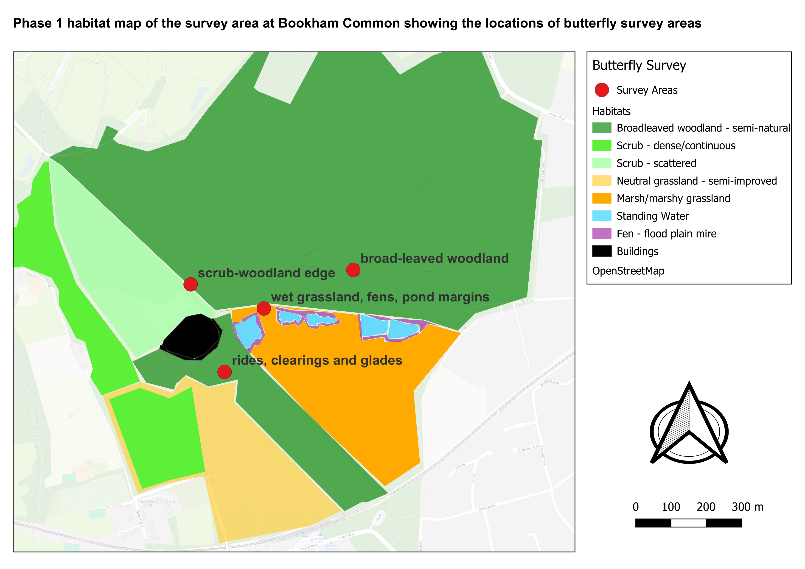

# Bookham Common Butterfly Survey (Phase 1 Habitat Context)

## Overview
This project presents a small-scale butterfly survey conducted at Bookham Common (Surrey, UK), over three days in August 2025.
Data analysed in relation to Phase 1 habitat types. The aim was to explore patterns of butterfly abundance and species richness across broad habitat categories within the survey area.

## Methods
- **Survey method:** Timed butterfly counts
- **Site:** Bookham Common
- **Survey dates:** August 2025
- **Environmental variables recorded:** Weather conditions and Beaufort wind scale
- **Habitat classification:** Phase 1 Habitat Survey categories

## Data
- Raw and cleaned survey records include:
  - Species (common and scientific names)
  - Minimum counts
  - Habitat type and habitat code
  - Weather conditions

## Analysis
Analysis was conducted using PostgreSQL and includes:
- Data validation checks
- Total abundance per habitat type
- Species richness per habitat
- Species-by-habitat summaries

## Outputs
- Cleaned CSV dataset
- Reproducible SQL analysis script
- Summary Results:

Total butterfly abundance and species richness by habitat type.

| Habitat type                         | Total abundance (n) | Species richness |
|-------------------------------------|---------------------|------------------|
| Scrub–woodland edge                 | 9                   | 4                |
| Wet grassland, fens, pond margins   | 8                   | 2                |
| Rides, clearings and glades         | 5                   | 2                |
| Broad-leaved woodland               | 4                   | 2                |

## Study Area and Habitat Context

The map below shows the Phase 1 habitat classification at Bookham Common and the locations of butterfly survey areas used in this study.

